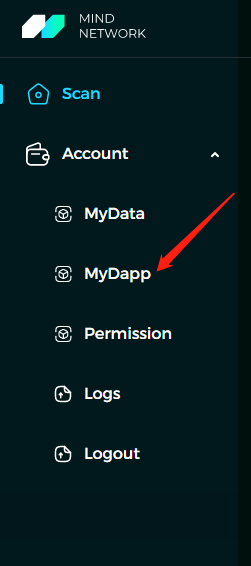
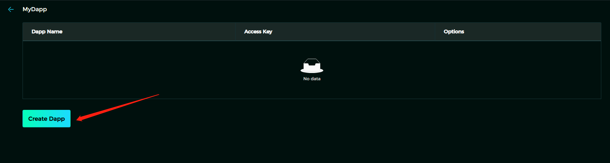
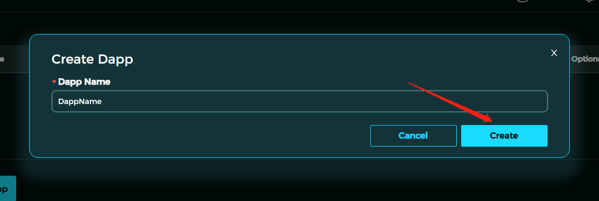
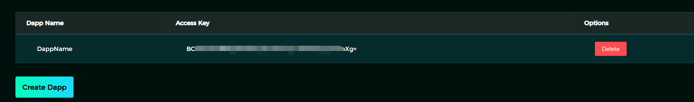

  
  <h1>MindLake Tutorial: Mind appKey</h1>
  
  

    A step-by-step cookbook for beginner to create Mind appKey !
  

<!-- toc generator: 1. install "markdown all in one" in vs code, 2. cmd: create table of contents -->
<!-- Table of Contents -->

You need to register an appKey in order to access Mind Lake during testing period. 
Here is the steps and screenshort. 

1. Visit https://scan.mindnetwork.xyz in your browser

2. Login with your MetaMask Wallet

3. Click `myDapp` in left side manu

3. Click "Create Dapp" 

4. Input your Dapp name and then click "Create"

5. copy appKey value into myconfig.ts to update "appKey"

