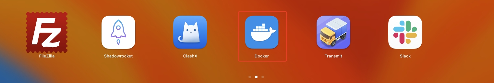
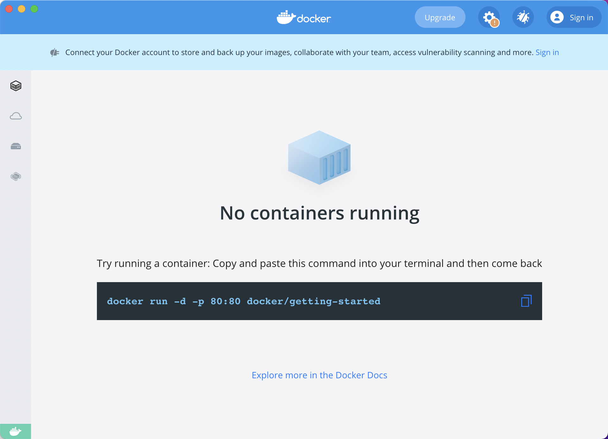
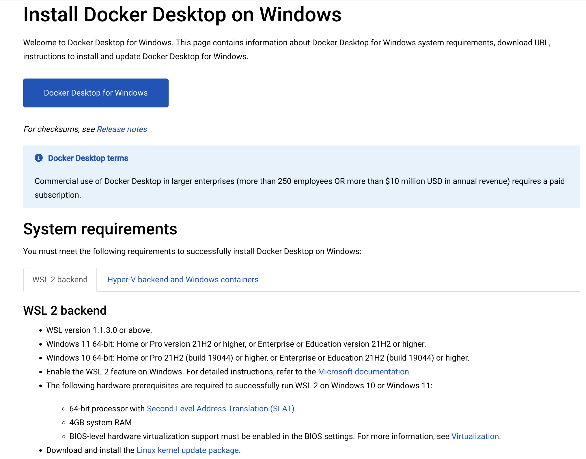
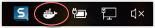
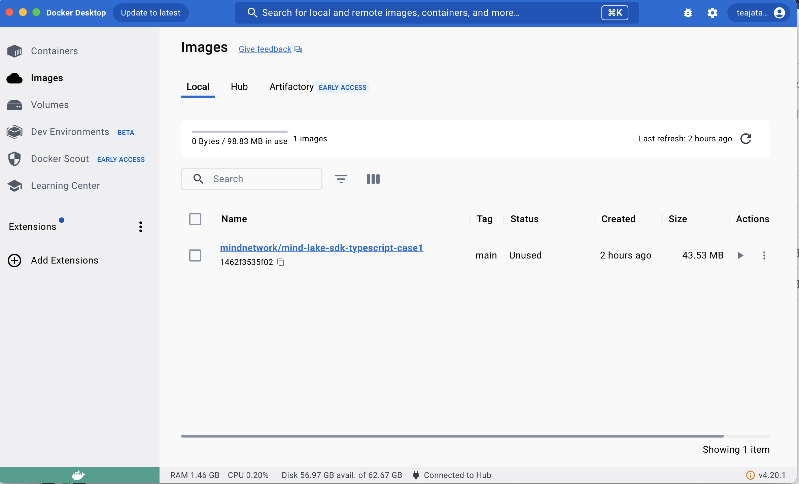
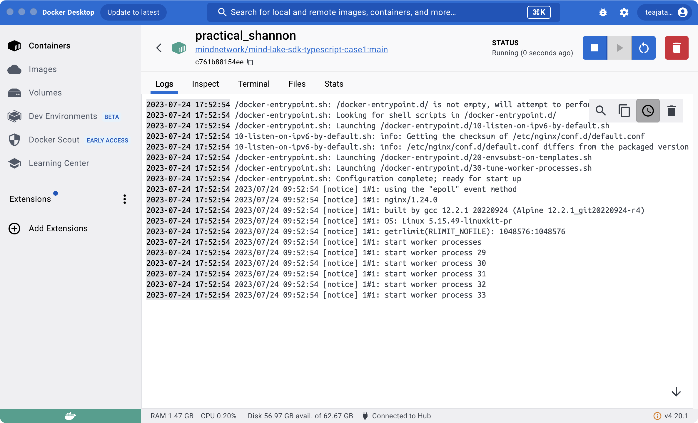

<div align="center">

  
  <h1>MindLake Tutorial: Configure Docker Case</h1>

  <p>
    A step-by-step cookbook for Docker Case Configuration !
  </p>
</div>

- [:star2: 0. Step by step tutorial](#star2-0-step-by-step-tutorial)
- [:star2: 1. Install docker](#star2-1-install-docker)
  - [:art: 1.1 For Mac OS](#art-11-for-mac-os)
    - [:dart: 1.1.2 Install docker with HomeBrew](#dart-112-install-docker-with-homebrew)
      - [:gear: 1.1.2.1 Step1: Install HomeBrew (If you don't have Homebrew installed)](#gear-1121-step1-install-homebrew-if-you-dont-have-homebrew-installed)
      - [:gear: 1.1.2.2 Step2: Install docker](#gear-1122-step2-install-docker)
  - [:art: 1.2 For Windows](#art-12-for-windows)
    - [:dart: 1.2.1 Download docker](#dart-121-download-docker)
    - [:dart: 1.2.2 Install docker](#dart-122-install-docker)
  - [:art: 2. Run docker case](#art-2-run-docker-case)
- [:star2: 3. Explore the use cases](#star2-3-explore-the-use-cases)

## :star2: 0. Step by step tutorial
This is part of support chapter for MindLake step-by-step tutorial for [Typescript](README.md)

## :star2: 1. Install docker

### :art: 1.1 For Mac OS

#### :dart: 1.1.2 Install docker with HomeBrew
If you need to install Nvm from the command line on macOS, the Homebrew package manager is a reliable option. Follow the steps below to install Nvm via Homebrew:
##### :gear: 1.1.2.1 Step1: Install HomeBrew (If you don't have Homebrew installed)
1. Open a browser and go to https://brew.sh.


2. Under the "Install Homebrew" title, copy the command
```shell
/bin/bash -c "$(curl -fsSL https://raw.githubusercontent.com/Homebrew/install/HEAD/install.sh)"
```


3. Then open a terminal window, paste the copied command, and press the 'Enter' or 'Return' button.


4. Enter your macOS credentials if and when asked.

5. If prompted, install Apple's command line developer tools.

##### :gear: 1.1.2.2 Step2: Install docker
1. Enter the following command in terminal to upgrade Homebrew:
```shell
brew install --cask docker
```
2. run docker app

Next, open docker app


3. check docker install success 
```shell
docker info
```
An example of the output is:
```shell
Client:
 Version:    24.0.2
 Context:    desktop-linux
 Debug Mode: false

Server:
 Containers: 7
  Running: 5
  Paused: 0
  Stopped: 2
 Images: 197
 Server Version: 24.0.2
 Storage Driver: overlay2
  Backing Filesystem: extfs
  Supports d_type: true
  Using metacopy: false
  Native Overlay Diff: true
  userxattr: false
 Logging Driver: json-file
 Cgroup Driver: cgroupfs
 Cgroup Version: 2
```

### :art: 1.2 For Windows

#### :dart: 1.2.1 Download docker
1. download Docker Desktop on Windows:

https://docs.docker.com/desktop/install/windows-install/



2. Double-click Docker Desktop `Installer.exe` to run the installer.

3. When prompted, ensure the `Use WSL 2 instead of Hyper-V` option on the Configuration page is selected or not depending on your choice of backend.

  - If your system only supports one of the two options, you will not be able to select which backend to use.

4. Follow the instructions on the installation wizard to authorize the installer and proceed with the install.

5. When the installation is successful, click `Close` to complete the installation process.

6. If your admin account is different to your user account, you must add the user to the `docker-users` group. Run `Computer Management` as an `administrator` and navigate to `Local Users and Groups > Groups > docker-users`. Right-click to add the user to the group. Log out and log back in for the changes to take effect.


#### :dart: 1.2.2 Install docker

1. Search for Docker, and select Docker Desktop in the search results.


2. The Docker menu (whale menu) displays the Docker Subscription Service Agreement window.



### :art: 2. Run docker case
1. Follow Step 1 to encure Docker is running. 


2. In command, pull docker image by copying and execute the command
```shell
docker pull mindnetwork/mind-lake-sdk-typescript-case1:main
```

```shell
docker pull mindnetwork/mind-lake-sdk-typescript-case2:main
```

```shell
docker pull mindnetwork/mind-lake-sdk-typescript-case3:main
```


mind lake case has 3 images:
- https://hub.docker.com/repository/docker/mindnetwork/mind-lake-sdk-typescript-case1
- https://hub.docker.com/repository/docker/mindnetwork/mind-lake-sdk-typescript-case2
- https://hub.docker.com/repository/docker/mindnetwork/mind-lake-sdk-typescript-case3

3. run docker image





4. bind port with docker image, copy the command
```shell
docker run -d -p 90:80 mindnetwork/mind-lake-sdk-typescript-case1:main
```

```shell
docker run -d -p 91:80 mindnetwork/mind-lake-sdk-typescript-case2:main
```

```shell
docker run -d -p 92:80 mindnetwork/mind-lake-sdk-typescript-case3:main
```

"90"、"91"、"92" are bind ports ,
"mindnetwork/mind-lake-sdk-typescript-case1:main"、
"mindnetwork/mind-lake-sdk-typescript-case2:main"、
"mindnetwork/mind-lake-sdk-typescript-case3:main" are docker repositories


5. run mind-lake-sdk-typescript-case1

Open your browser and enter localhost
```http
http://localhost:90/use_case_1.html
```


```http
http://localhost:91/use_case_2.html
```
```http
http://localhost:92/use_case_3.html
```


At last, you have successfully executed case1 by use docker !!!

## :star2: 3. Explore the use cases
You can jump to [:art: 6.2 Use Case 1](README.md#art-62-use-case-1-single-user-with-structured-data) to continue to explore the use cases.