<div align="center">

  
  <h1>MindLake Typescript SDK Tutorial</h1>
  
  <p>
    A step-by-step cookbook for beginner to access Mind Lake !
  </p>
</div>

<!-- toc generator: 1. install "markdown all in one" in vs code, 2. cmd: create table of contents -->
<!-- Table of Contents -->
## :notebook_with_decorative_cover: Table of Contents
- [:notebook\_with\_decorative\_cover: Table of Contents](#notebook_with_decorative_cover-table-of-contents)
- [:star2: 0. Other Programming Languages](#star2-0-other-programming-languages)
- [:star2: 1. Install Node Package Management Tools: Nvm](#star2-1-install-node-package-management-tools-nvm)
  - [:art: 1.1 For Mac OS](#art-11-for-mac-os)
    - [:dart: 1.1.2 Install Nvm with HomeBrew](#dart-112-install-nvm-with-homebrew)
      - [:gear: 1.1.2.1 Step1: Install HomeBrew (If you don't have Homebrew installed)](#gear-1121-step1-install-homebrew-if-you-dont-have-homebrew-installed)
      - [:gear: 1.1.2.2 Step2: Install Nvm](#gear-1122-step2-install-nvm)
      - [:gear: 1.1.2.3 Step3: Verify the Nvm Installation](#gear-1123-step3-verify-the-nvm-installation)
  - [:art: 1.2 For Windows](#art-12-for-windows)
    - [:dart: 1.2.1 Download Nvm](#dart-121-download-nvm)
    - [:dart: 1.2.2 Run exe installation file](#dart-122-run-exe-installation-file)
    - [:dart: 1.2.3 Validate nvm installation](#dart-123-validate-nvm-installation)
- [:star2: 2. Install Node](#star2-2-install-node)
  - [:art: 2.1 Install Node](#art-21-install-node)
  - [:art: 2.2 Select right Node 16 version if not correct](#art-22-select-right-node-16-version-if-not-correct)
  - [:art: 2.3 Validate if correct node version](#art-23-validate-if-correct-node-version)
- [:star2: 3. Get Examples](#star2-3-get-examples)
- [:star2: 4. Prepare myconfig.ts](#star2-4-prepare-myconfigts)
  - [:art: 4.1. Prepare Wallet](#art-41-prepare-wallet)
    - [:dart: 4.1.1 Install Wallet](#dart-411-install-wallet)
    - [:dart: 4.1.2 Wallet Sign In: https://scan.mindnetwork.xyz](#dart-412-wallet-sign-in-httpsscanmindnetworkxyz)
    - [:dart: 4.1.3 Register wallets if not in whitelist during testing period](#dart-413-register-wallets-if-not-in-whitelist-during-testing-period)
  - [:art: 4.2. Prepare appKey](#art-42-prepare-appkey)
      - [:dart: 4.2.1 create Dapp](#dart-421-create-dapp)
- [:star2: 5. Execute the examples](#star2-5-execute-the-examples)
  - [:art: 5.1 QuickStart](#art-51-quickstart)
  - [:art: 5.2 Use Case 1: Single User with Structured Data](#art-52-use-case-1-single-user-with-structured-data)
  - [:art: 5.3 Use Case 2: Single User with Unstructured Data](#art-53-use-case-2-single-user-with-unstructured-data)
  - [:art: 5.4 Use Case 3: Multi Users with Permission Sharing](#art-54-use-case-3-multi-users-with-permission-sharing)


## :star2: 0. Other Programming Languages
- [Python](https://github.com/mind-network/mind-lake-sdk-python/)

## :star2: 1. Install Node Package Management Tools: Nvm

### :art: 1.1 For Mac OS

#### :dart: 1.1.2 Install Nvm with HomeBrew
If you need to install Nvm from the command line on macOS, the Homebrew package manager is a reliable option. Follow the steps below to install Nvm via Homebrew:
##### :gear: 1.1.2.1 Step1: Install HomeBrew (If you don't have Homebrew installed)
1. Open a browser and go to https://brew.sh.

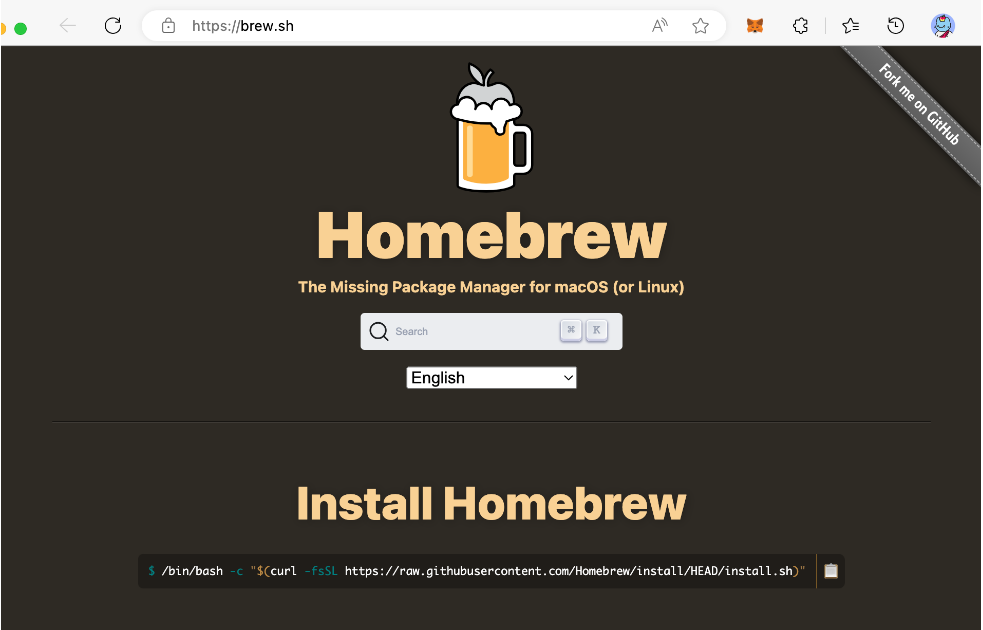

2. Under the "Install Homebrew" title, copy the command
```shell
/bin/bash -c "$(curl -fsSL https://raw.githubusercontent.com/Homebrew/install/HEAD/install.sh)"
```

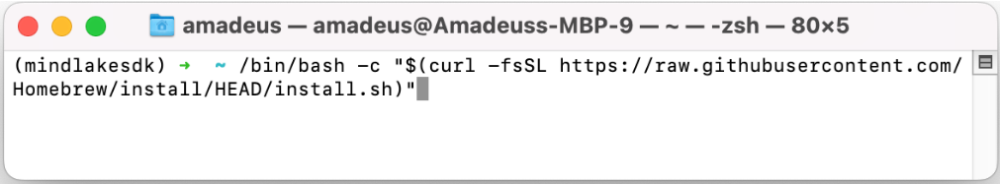

3. Then open a terminal window, paste the copied command, and press the 'Enter' or 'Return' button.

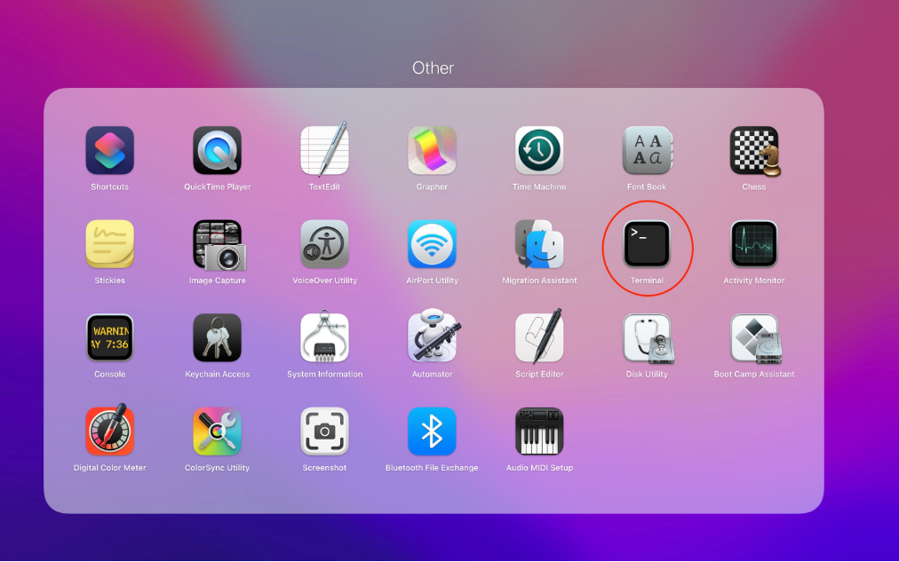

4. Enter your macOS credentials if and when asked.
5. If prompted, install Apple's command line developer tools.

##### :gear: 1.1.2.2 Step2: Install Nvm
1. Enter the following command in terminal to upgrade Homebrew:
```shell
brew update && brew upgrade
```
2. Install `nvm` using this command:
```shell
brew install nvm
```
Next, create a directory for nvm at home.
```
mkdir ~/.nvm 
```
Now, configure the required environment variables. Edit the following configuration file in your home directory
```
vim ~/.bash_profile
```
and, add the below lines to `~/.bash_profile` ( or `~/.zshrc` for macOS Catalina or newer versions)
```
export NVM_DIR=~/.nvm
source $(brew --prefix nvm)/nvm.sh
```
Press `ESC` + `:wq` to save and close your file.

Next, load the variable to the current shell environment. From the next login, it will automatically loaded.
```
source ~/.bash_profile
```
That’s it. The nvm has been installed on your macOS system.

##### :gear: 1.1.2.3 Step3: Verify the Nvm Installation
Enter the following command in terminal:
```shell
nvm --version
```
An example of the output is:
```
1.1.7
```


### :art: 1.2 For Windows
Open Terminal on Windows:
1. press `WIN` + `R` key
2. type `CMD` in the prompt
3. press `ENTRY` key


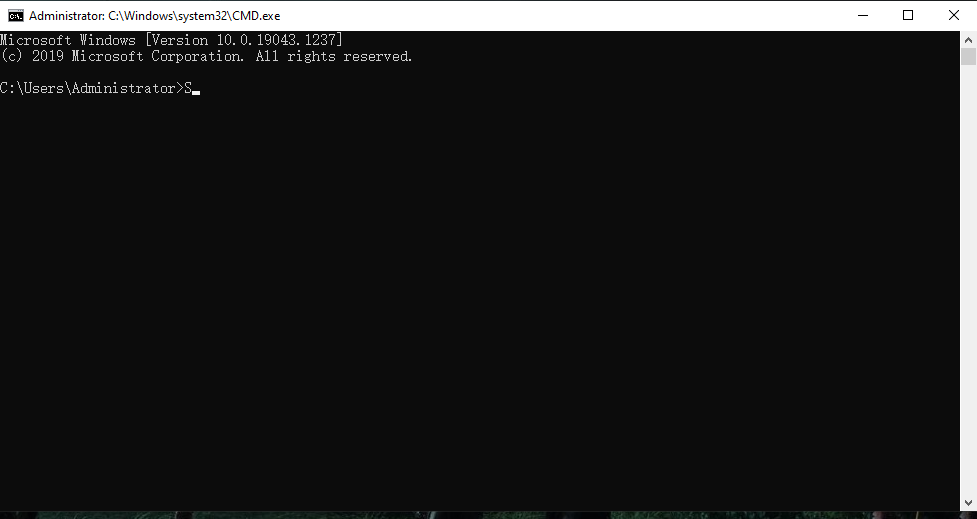

#### :dart: 1.2.1 Download Nvm
1. Open a browser and go to [nvm downloads for Windows](https://github.com/coreybutler/nvm-windows/releases)
2. Download nvm-setup.exe

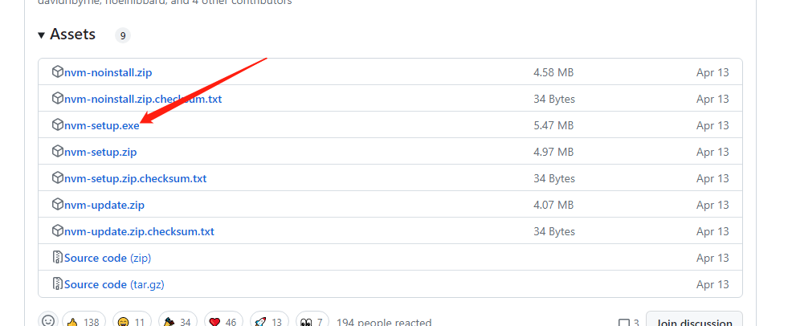

#### :dart: 1.2.2 Run exe installation file
Double Click nvm-setup.exe to run

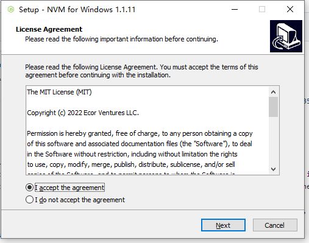

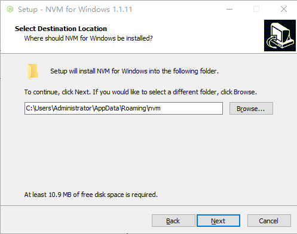

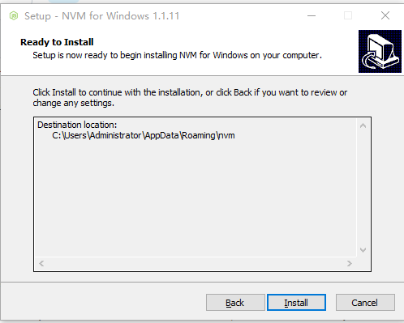

#### :dart: 1.2.3 Validate nvm installation
  ```cmd
nvm version
```
An example of the output is:
```
1.1.7
```

## :star2: 2. Install Node
### :art: 2.1 Install Node
```
nvm install 16
```
An example of the output is:
```
Downloading node.js version 16.13.1 (64-bit)...
Complete
Creating D:\program\nvm\temp

Downloading npm version 8.1.2... Complete
Installing npm v8.1.2...

Installation complete. If you want to use this version, type

nvm use 16.13.1
```
### :art: 2.2 Select right Node 16 version if not correct
`Node16` is recommended. `Node18` still have issues and is not recommeded right now,
```cmd
nvm use 16
```
An example of the output is:
```
Now using node v16.13.1 (64-bit)
```

### :art: 2.3 Validate if correct node version
```cmd
node -v
```
An example of the output is:
```
v16.13.1
```

## :star2: 3. Get Examples
1. Enter the following command in the terminal window to fetch the example code from github:
```shell
git clone https://github.com/mind-network/mind-lake-sdk-typescript.git
```
2. Enter the path of example code:
```shell
cd mind-lake-sdk-typescript/examples
```
3. Install depedency
```cmd
npm install
```
4. Check mind-lake-sdk depedency 
```cmd
npm info mind-lake-sdk version
```
An example of the output is:
```cmd
1.0.2
```

## :star2: 4. Prepare myconfig.ts
`myconfig.ts` contains the settings of parameters used in examples and use cases, you can copy `myconfig_template.ts` to the name `myconfig.ts` and modify it as per your requirement. If you want to run the examples of quickStart, Use Case 1 and Use Case 2, you only need to fill out `appKey`. If you want to run Use Case 3, you need to fill out the walltes info for all of Alice, Bob and Charlie
```
export const appKey = "YOUR_APP_KEY";
export const nodeUrl = "https://sdk.mindnetwork.xyz"; // or change to other node url
export const aliceWalletAddress = "Alice_Wallet_Address";
export const bobWalletAddress = "Bob_Wallet_Address";
export const charlieWalletAddress = "Charlie_Wallet_Address";
```

### :art: 4.1. Prepare Wallet
#### :dart: 4.1.1 Install Wallet
1. Install [MetaMask](https://metamask.io/download/) plugins in Chrome Browser
2. [Sign up a MetaMask Wallet](https://myterablock.medium.com/how-to-create-or-import-a-metamask-wallet-a551fc2f5a6b)
3. Change the network to Goerli TestNet. If the TestNets aren't displayed, turn on "Show test networks" in Settings.

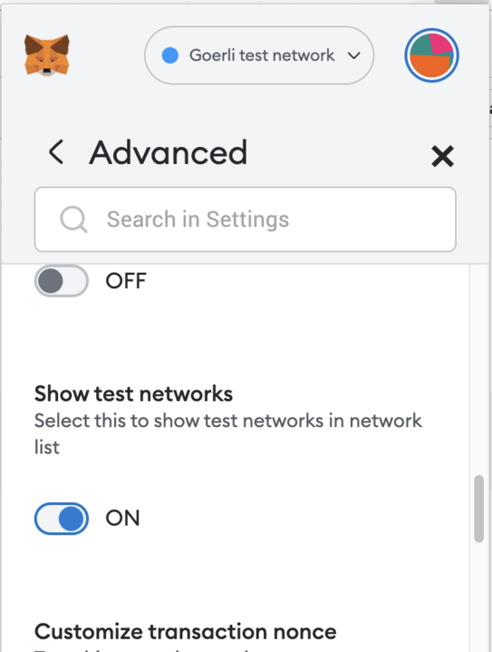

4. Change the network to Goerli TestNet
5. Goerli Faucet for later gas fee if does not have: [Alchemy Goerli Faucet](https://goerlifaucet.com/), [Quicknode Goerli Faucet](https://faucet.quicknode.com/ethereum/goerli), [Moralis Goerli Faucet](https://moralis.io/faucets/)

  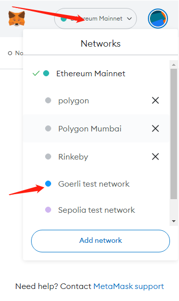
  
#### :dart: 4.1.2 Wallet Sign In: https://scan.mindnetwork.xyz
1. Open a browser and visit [mind-scan](https://scan.mindnetwork.xyz/scan)
2. Click "Sign in" buttom

  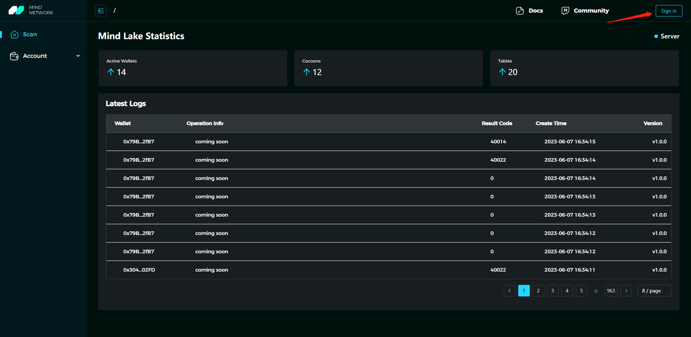
  
2.1 During the 'Connect' procedure, the wallet will prompt the user 2-3 times as follows:
   Sign a nonce for login authentication.
  
  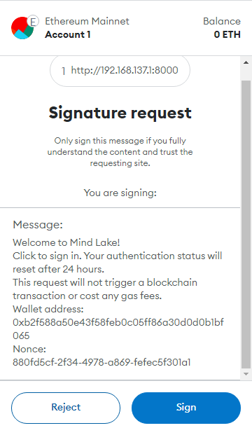
  
2.2 If the user's account keys are already on the chain: Decrypt the user's account keys using the wallet's private key.
  
  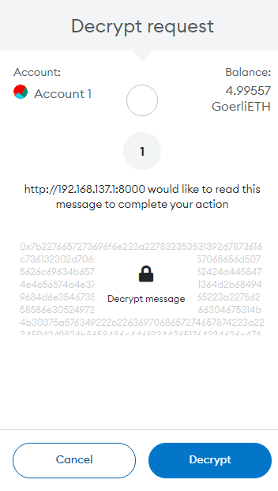

2.3 If the user's account keys do not exist yet: Obtain the public key of the wallet, which is used to encrypt the randomly generated account keys.
  
  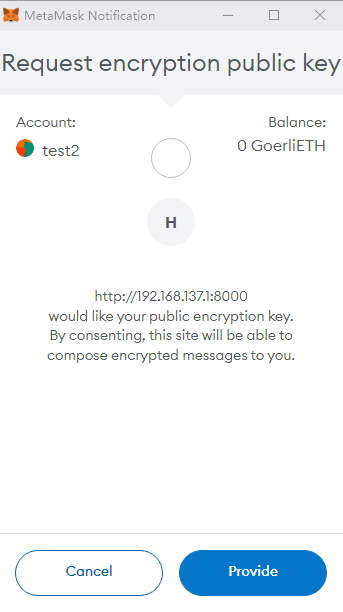

2.4 Sign the transaction to upload the encrypted key ciphers to the smart contract on the chain.
  
  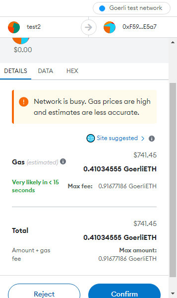

#### :dart: 4.1.3 Register wallets if not in whitelist during testing period
1. If not in whitelist, there will be a pop-up prompt
  
  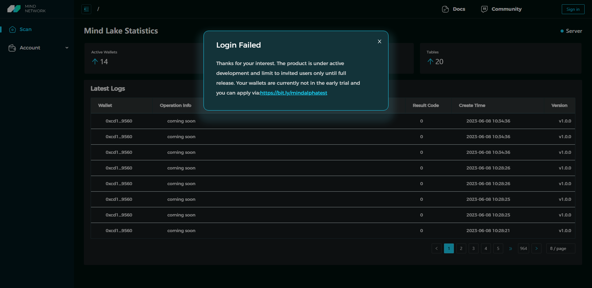

2. Click [Apply for test link ](https://bit.ly/mindalphatest)
3. After successful application, Please be patient and wait for the review.

### :art: 4.2. Prepare appKey
##### :dart: 4.2.1 create Dapp
1. Click `myDapp` in left side manu


2. Click "Create Dapp" 


3. Input your Dapp name and then click "Create"


4. copy appKey value into myconfig.ts to update "appKey"


## :star2: 5. Execute the examples
You can execute the following commands to run the quickstart and use cases.

```
cd examples
npm run start
```
An example of the output is:
```
  App running at:
  - Local:   http://localhost:8002 (copied to clipboard)
  - Network: http://192.168.137.1:8002
```
By default use 8000 as port number. But will auto increase port number if 8000 is used. You may see 8000 in your side. The example bellow 8002. Use the port number shown in your terminal.
Open a browser and visit `http://localhost:8002` 

### :art: 5.1 QuickStart

1. First, you should create a test wallet for test.
  
  

  

2. Click "Quick start with your MetaMask" and you will see the logs while login with your MetaMask wallet


### :art: 5.2 Use Case 1: Single User with Structured Data
1. Open a browser and visit `http://localhost:8002/use_case_1`
2. Click "Test case one with your MetaMask" and you will see the logs while executing Use Case 1.


### :art: 5.3 Use Case 2: Single User with Unstructured Data
1. Open a browser and visit `http://localhost:8002/use_case_2`
2. Click "Test case two with your MetaMask" and you will see the logs while executing Use Case 2


### :art: 5.4 Use Case 3: Multi Users with Permission Sharing
1. You will need 3 wallets for Use Case 3: Alice, Bob, Charlie
  We show how to create a wallet for Alice for testing purpose.

  

  

  Using the same way to create wallet for Bob and Charlie
  
  Copy Alice,Bob,Charlie' wallet address into myconfig.ts to update `aliceWalletAddress` `bobWalletAddress` `charlieWalletAddress`

2. Open a browser and visit `http://localhost:8002/use_case_3`


3. Switch to Alice's wallet and perform actions as Alice 

  

  

  Click "Insert Alice Data And Share To Charlie"
   
  
  
  Wait until "insert data done" appears which means data insertion is completely. 
   
4. Switch to BOb's wallet and performa actions as Bob

  

  

  Click "Insert Bob Data And Share To Charlie"  
  
  

  Wait until "insert data done" appears which means data insertion is completely. 
  
5. Switch to Charlie's wallet and performa actions as Charlie
  
  

  

  Click "Charlie Select Data And Decrypt Data"
  
  

6. Final output quick view

 

  
