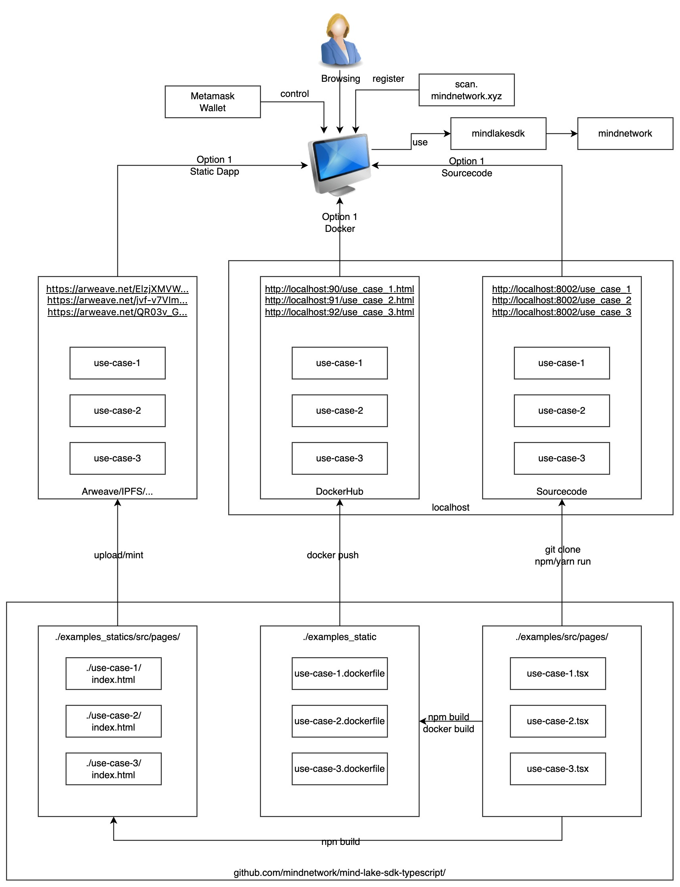

<div align="center">

  
  <h1>MindLake Tutorial: Typescript SDK</h1>
  
  <p>
    A step-by-step cookbook for beginner to access Mind Lake !
  </p>
</div>

<!-- toc generator: 1. install "markdown all in one" in vs code, 2. cmd: create table of contents -->
<!-- Table of Contents -->
## :notebook_with_decorative_cover: Table of Contents
- [:notebook\_with\_decorative\_cover: Table of Contents](#notebook_with_decorative_cover-table-of-contents)
- [:star2: 0. Other Programming Languages](#star2-0-other-programming-languages)
- [:star2: 1. Prepare Wallet](#star2-1-prepare-wallet)
- [:star2: 2. Choose a Method to Explore MindLake SDK](#star2-2-choose-a-method-to-explore-mindlake-sdk)
  - [:art: 2.1 Option 1: Use dApp Page Hosted on Arweave](#art-21-option-1-use-dapp-page-hosted-on-arweave)
  - [:art: 2.2 Option 2: Use Docker Image](#art-22-option-2-use-docker-image)
  - [:art: 2.3 Option 3: Compile with Node.js](#art-23-option-3-compile-with-nodejs)
- [:star2: 3. Install Or Upgrade Node If Needed (for Option 3)](#star2-3-install-or-upgrade-node-if-needed-for-option-3)
- [:star2: 4. Get Examples sourcecode and compile locally (for Option 3)](#star2-4-get-examples-sourcecode-and-compile-locally-for-option-3)
- [:star2: 5. Prepare myconfig.ts (for Option 3)](#star2-5-prepare-myconfigts-for-option-3)
- [:star2: 6. Execute the examples](#star2-6-execute-the-examples)
  - [:art: 6.1 QuickStart](#art-61-quickstart)
  - [:art: 6.2 Use Case 1: Single User with Structured Data](#art-62-use-case-1-single-user-with-structured-data)
  - [:art: 6.3 Use Case 2: Single User with Unstructured Data](#art-63-use-case-2-single-user-with-unstructured-data)
  - [:art: 6.4 Use Case 3: Multi Users with Permission Sharing](#art-64-use-case-3-multi-users-with-permission-sharing)


## :star2: 0. Other Programming Languages
- [Python](https://github.com/mind-network/mind-lake-sdk-python/)

## :star2: 1. Prepare Wallet
- Click [:star2: 1. Prepare Wallet](Configure_Wallet.md) to get your wallet ready for the use cases.

## :star2: 2. Choose a Method to Explore MindLake SDK
In this tutorial, we provide 3 options to explore MindLake SDK with 3 use cases. 
All options has same dapp code but host in different ways. 
Here is the overall architecture:



### :art: 2.1 Option 1: Use dApp Page Hosted on Arweave
For beginners without tech background, we recommend to access the already compiled dApp page hosted on Arweave to have a quick glance at the use cases. You can jump to [:art: 6.2 Use Case 1](#art-62-use-case-1-single-user-with-structured-data)

### :art: 2.2 Option 2: Use Docker Image
For developers who don't want to install Node.js, we recommend to use the docker image to run the examples. You can click [Use Docker Image](Configure_Docker_Case.md).

### :art: 2.3 Option 3: Compile with Node.js
For developers who want to explore the source code, we recommend to compile the use cases with Node.js and run the examples. You can continue to read the following sections.


## :star2: 3. Install Or Upgrade Node If Needed (for Option 3)
- If you are following Option 2 and Option 3, you can ignore this steps as envrioment is pre-configured. 
- If you are following Option 3 to compile sourcecode locally, please click to view [step-by-step to configure Node](Configure_Node.md) if Node is not installed or upgraded

## :star2: 4. Get Examples sourcecode and compile locally (for Option 3)
- If you are following Option 2 and Option 3, you can ignore this steps as sourcecode are compiled and can run in your browser directly. 
- If you are following Option 3 to compile sourcecode locally, please follow bellow steps to build locally. 
1. Enter the following command in the terminal window to fetch the example code from github:
```shell
git clone https://github.com/mind-network/mind-lake-sdk-typescript.git
```
1. Enter the path of example code:
```shell
cd mind-lake-sdk-typescript/examples
```
1. Install depedency
```cmd
npm install
```
1. Check mind-lake-sdk depedency 
```cmd
npm info mind-lake-sdk version
```
An example of the output is:
```cmd
1.0.2
```

## :star2: 5. Prepare myconfig.ts (for Option 3)
- If you are following Option 2 and Option 3, you can ignore this steps as configuration is done and can run in your browser directly. 
- If you are following Option 3 to compile sourcecode locally, please follow bellow steps to configure locally. 
  
1. `myconfig.ts` contains the settings of parameters used in examples and use cases, you can copy `myconfig_template.ts` to the name `myconfig.ts` and modify it as per your requirement.
2. `myconfig.ts` will need walletAddress and appKey.
3. If you want to run the examples of quickStart, Use Case 1 and Use Case 2, you only need to fill out `appKey`. You can click [Create Mind appKey](Configure_AppKey.md). 

4. If you want to run Use Case 3, you need to fill out the wallets info for all of `Alice`, `Bob` and `Charlie`.
    - You can click [:star2: 1. Prepare Wallet](Configure_Wallet.md) again if you haven't get all the 3 wallets ready.

```
export const appKey = "YOUR_APP_KEY";
export const nodeUrl = "https://sdk.mindnetwork.xyz"; // or change to other node url
export const aliceWalletAddress = "Alice_Wallet_Address";
export const bobWalletAddress = "Bob_Wallet_Address";
export const charlieWalletAddress = "Charlie_Wallet_Address";
```

## :star2: 6. Execute the examples
If you are following Option 3, You can execute the following commands to run the quickstart and use cases.
```
cd examples
npm run start
```
An example of the output is:
```
  App running at:
  - Local:   http://localhost:8002 (copied to clipboard)
  - Network: http://192.168.137.1:8002
```
By default use 8000 as port number. But will auto increase port number if 8000 is used. You may see 8001 or other incremental in your side. The example bellow 8002. Use the port number shown in your terminal.
Open a browser and visit `http://localhost:8002` 

For bellow steps, we have list the command and screenshot in Option 3 by default, but also list the urls in Option 1 and Option 2. 

### :art: 6.1 QuickStart

1. First, you should create a test wallet for test.
  
  

  

2. Click "Quick start with your MetaMask" and you will see the logs while login with your MetaMask wallet


### :art: 6.2 Use Case 1: Single User with Structured Data
1. Open a browser and visit `http://localhost:8002/use_case_1`
    - For Option 1, we hosted a same page on Arweave: https://arweave.net/ElzjXMVWIUMavlUbBhXHSl5JopcbL3H_E_0KehsMfPg
    - For Option 2, you may see docker instance and visit your browser in http://localhost:90/use_case_1.html  
2. Click "Test case one with your MetaMask" and you will see the logs while executing Use Case 1.


### :art: 6.3 Use Case 2: Single User with Unstructured Data
1. Open a browser and visit `http://localhost:8002/use_case_2`
    - For Option 1, we hosted a same page on Arweave: https://arweave.net/jvf-v7VImOAQ67uzG1CCGqZuVPXGvIE1S-l8MO3A75U
    - For Option 2, you may see docker instance and visit your browser in http://localhost:91/use_case_2.html  
2. Click "Test case two with your MetaMask" and you will see the logs while executing Use Case 2


### :art: 6.4 Use Case 3: Multi Users with Permission Sharing
1. You will need 3 wallets for Use Case 3: Alice, Bob, Charlie
  We show how to create a wallet for Alice for testing purpose.

  

  

  Using the same way to create wallet for Bob and Charlie
  
  Copy Alice,Bob,Charlie' wallet address into myconfig.ts to update `aliceWalletAddress` `bobWalletAddress` `charlieWalletAddress`

  > **Note**
  > During testing period, please make you have all wallet address are registered in into whitelist: https://sites.google.com/mindnetwork.xyz/mindnetwork/alpha-test.
  > Be more specific, please ensure your Alice, Bob and Charlie are registered and approved. Otherwise, you may experience the error on sharing. 

2. Open a browser and visit `http://localhost:8002/use_case_3`
    - For Option 1, we hosted a same page on Arweave: https://arweave.net/QR03v_GcZlEnbuny9e5kb149WL4E2_gFe8pbFOMExbE
    - For Option 2, you may see docker instance and visit your browser in http://localhost:92/use_case_3.html  


1. Switch to Alice's wallet and perform actions as Alice 

  

  

  Click "Insert Alice Data And Share To Charlie"
   
  
  
  Wait until "insert data done" appears which means data insertion is completely. 
   
4. Switch to BOb's wallet and performa actions as Bob

  

  

  Click "Insert Bob Data And Share To Charlie"  
  
  

  Wait until "insert data done" appears which means data insertion is completely. 
  
5. Switch to Charlie's wallet and performa actions as Charlie
  
  

  

  Click "Charlie Select Data And Decrypt Data"
  
  

6. Final output quick view

 

  
